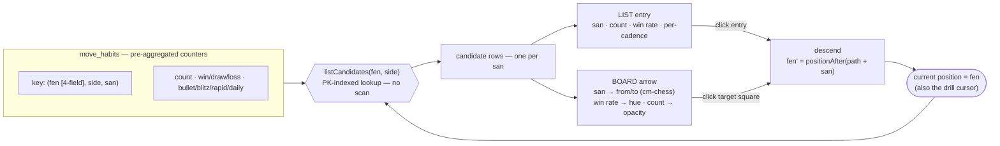

# Move habit statistics are precomputed incrementally during import, not computed on demand

`Move habit` (frequency and win rate per Move from a recurring Position, merged by transposition)
could either be computed on the fly each time the explorer is opened, by scanning the full game
history, or precomputed and updated incrementally as each Game is imported. We chose the
**incremental precomputation** approach: since `Import` is already incremental (ADR-0003) —
each Game is only ever processed once — the same pass updates the relevant `Move habit`
counters, rather than rescanning the whole history on every read.

## Considered options

- **On-the-fly computation**: simplest to implement (no extra storage, no update logic to keep in sync), but gets slower as the game history grows, since every explorer view would rescan potentially thousands of Games.
- **Incremental precomputation (chosen)**: `Move habit` counters (per Position reached, per Move played from it, per side) are updated once when a Game enters the database, alongside its Evaluations. Reading the explorer becomes a simple lookup instead of a full scan. The explorer runs over **all** imported Games (no per-run scope selector) — precisely because a single global aggregate answers the read directly.

## The precomputation is a standalone function, invoked at every entry point

The counter-update logic lives in **one standalone function**, not inlined into whichever code path happens to add a Game. It is called at **both** points where a Game enters the database:

- the real chess.com `Import` path (`importMonth`, US-2) — the data the HP suite exercises;
- the `Move habit` **fixture seeding** path — the deterministic data the sub-tickets' Feature Paths exercise.

This keeps the aggregation logic identical across entry points and lets each feature be wired independently (see `[[feature-independent-functions]]` in the project memory) rather than duplicated.

## The transposition merge key is the 4-field FEN

Positions are merged across Games by transposition (see `Move habit` in `CONTEXT.md`), so the
aggregate is keyed by the **Position identity**, not the raw `cm-chess` FEN. `cm-chess` emits a
full 6-field FEN whose last two fields — the halfmove clock and the fullmove number — vary with
the depth and move order used to reach a position. Keying on the full FEN would therefore split
genuine transpositions into separate entries and silently break the merge rule (the feature's
central correctness property).

The merge key is the **first four FEN fields**: piece placement, active colour, castling rights,
and en-passant target square (together with the player's side — White/Black — as a separate key
component, since the explorer is scoped to the side the player played). The two move counters are
dropped.

The en-passant field is kept **as `cm-chess` emits it** (i.e. set whenever a pawn has just made
a double step, even when no en-passant capture is actually legal). This can, in rare cases, keep
two otherwise-identical positions from merging. Normalising it (clearing the field unless a
capture is legal) is deliberately **not** done: the extra logic is not worth it for a local,
single-user stats tool (ADR-0002), and the miss is a marginal under-merge, never an incorrect
merge.

## A per-Game flag guards against double counting

Because the stored structure is **pre-aggregated** (running totals per FEN/side/Move), re-running the precomputation over a Game it already counted would **double-count** — the aggregate is not naturally idempotent, unlike a per-event table would be. Each `games` row therefore carries a `move_habits_computed` flag: the precomputation skips a Game already flagged and sets it once done. A Game is counted **exactly once**, whichever entry point processed it.

## Shape at a glance (why it fits the board + arrows)

The aggregate is **read the same way it is drawn**: one lookup by `(fen, side)` returns the
candidate rows for the Position currently on the board, and each row already carries everything a
list entry *and* a board arrow need. Drilling down just recomputes `fen` and repeats the lookup —
`fen` is at once the board's Position and the navigation cursor, so board, arrows and list stay in
lockstep. Because the key's `fen` is the **4-field** form, every Game that reached the Position
(via any move order) feeds the *same* arrows (transposition merge). Flipping the `side` filter
swaps White/Black habits without recomputation; whether a row is a `Move habit` or an
`Opponent reply` is read from the Position's side to move versus `side` (not stored).

## Consequences

Adds a real aggregate data structure (positions reached, keyed by FEN, with per-move counters) alongside the raw Game/PGN storage — not just derived, on-demand math. If the depth cap (20 full moves) or the transposition-merging rule (ADR context: `Move habit` in `CONTEXT.md`) ever changes, existing precomputed counters need a one-time recomputation pass, not just a code change.

**No backfill of pre-existing Games** is provided: Games imported before this feature existed carry no counters and are not retro-computed. Refreshing them means wiping the local SQLite database and re-importing from scratch — acceptable for a single-user, local, throwaway-data tool (ADR-0002). Note that a plain re-import over existing data is a no-op here: `Import` dedups by game URL, so an already-present Game is skipped and never re-enters the insertion path.
