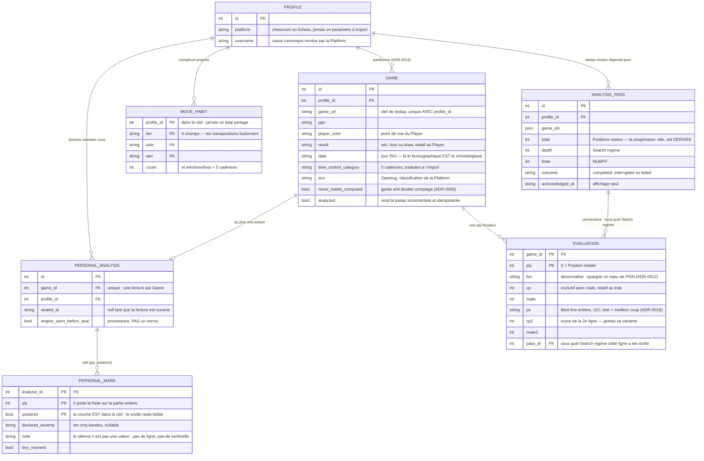
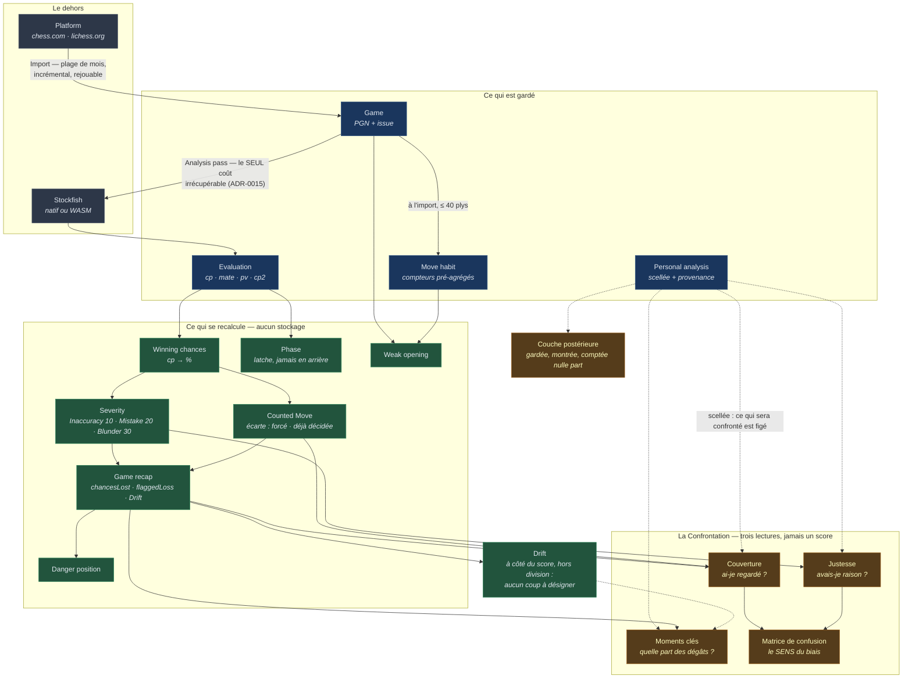

# Revue de code complète — 31 août 2026

Revue menée depuis `integration/US-16-my-own-analysis`, puis **revérifiée sur `develop`
après le merge d'US-22** (`dfc1ebe`) : les quinze constats tiennent tous, et F-01 a empiré
(1 328 → 1 349 erreurs). US-22 n'a touché que le client et `eslint.config.js` ; `server/src`
est inchangé, donc F-02 à F-11 et F-13 à F-15 portent sur du code identique.
Périmètre : `server/src` (~95 fichiers), `client/src` (~115 fichiers), schéma, migrations,
outillage. 30 728 lignes de TypeScript au total, tests compris.

## Ce que la revue a établi de vérifiable

| Contrôle | Résultat |
| --- | --- |
| `npm run build` (tsc serveur + tsc/vite client) | **vert** |
| `npm test` | **vert** — 35 + 54 fichiers, **1 104 tests** |
| `npm run lint` | **cassé** — 1 328 erreurs de *parsing* (voir F-01) |
| `any` / `@ts-ignore` / `@ts-expect-error` | **zéro** |
| `TODO` / `FIXME` / `HACK` | **zéro** |
| Volumétrie locale | 702 Games, 23 604 `move_habits`, 197 `Evaluation`s |

## Impression d'ensemble

C'est une base de code inhabituellement soignée. Trois choses la sortent du lot :

1. **Le vocabulaire du domaine est dans le code, pas seulement dans `CONTEXT.md`.**
   `ConfrontationRefusal`, `SealRefusal`, `UncountedReason`, `DeclaredSeverity`,
   `SearchRegime` — les refus métier sont des *classes nommées*, pas des chaînes jetées.
   Un lecteur qui a lu le glossaire sait lire le code, et l'inverse.
2. **Les commentaires expliquent les *décisions*, pas la syntaxe.** `posterior` fait partie
   de la clef primaire *et le commentaire dit pourquoi une seule ligne par ply effacerait la
   lecture initiale*. C'est de la documentation qui survit au refactoring parce qu'elle porte
   sur l'intention.
3. **Les invariants sont tenus au bon endroit.** Numérateurs et dénominateurs voyagent
   non divisés pour que l'agrégat soit une somme et non une moyenne de taux (ADR-0017) ;
   `foldConfrontations` *est* la définition de l'agrégat, pas une seconde requête qui
   diverge en silence. C'est le genre de choix qu'on ne rattrape pas après coup.

Les défauts trouvés ne sont donc presque jamais des erreurs de raisonnement. Ce sont des
**invariants documentés qui ne sont pas tenus partout**, et de la **dette d'infrastructure**
que la croissance du projet vient de rendre exigible.

---

## Constats

Sévérité : **haute** = corruption de données ou invariant documenté violé ·
**moyenne** = bug latent, coût qui grandit · **basse** = qualité, cohérence.

### F-01 — `npm run lint` ne tourne plus du tout · haute

`eslint.config.js:7` ignore `dist`, `node_modules` et `*.db` — mais pas `.claude/worktrees/`.
Cinq worktrees y sont checkoutés (US-16a, US-18, US-20-backlog, US-22), chacun avec son
`tsconfig.json`. `typescript-eslint` trouve donc cinq racines candidates et refuse de parser
quoi que ce soit :

```
error  Parsing error: No tsconfig
RootDir was set, and multiple candidate TSConfigRootDirs are present
✖ 1328 problems (1328 errors, 0 warnings)
```

Aucune de ces 1 328 erreurs ne parle du code. Le linter est le seul des trois garde-fous
(build / tests / lint) qui soit tombé, et il est tombé **silencieusement** : le gate
d'auto-merge décrit dans `CLAUDE.md` ne l'inclut pas, donc rien ne l'a signalé.

**Correctif** : ajouter `".claude/**"` aux `ignores`, et fixer `tsconfigRootDir:
import.meta.dirname` dans les `parserOptions`. Deux lignes.

### F-02 — `GET /api/games/:id` et `/:id/annotations` ne sont pas scopées au `Profile` · haute

`server/src/routes/games.ts:26-44`. Toutes les autres routes passent par `scopedProfile`
(`routes/scope.ts`), dont le commentaire dit exactement pourquoi : *« répondre sur toutes les
lignes est l'échec silencieux que cette story existe pour supprimer »*. Ces deux-là ne le font
pas : elles prennent un id, et répondent.

C'est d'autant plus visible que le routeur `/api/personal` juste à côté vérifie **deux fois** —
le profil, puis que le Game appartienne à ce profil — et refuse en 404 « Partie introuvable
pour ce profil ». La partition ADR-0014 est tenue avec rigueur partout, sauf sur la route qui
sert les annotations du moteur, c'est-à-dire précisément ce que `/personal` protège.

En local mono-utilisateur ce n'est pas une faille d'accès ; c'est un **trou dans un invariant
que le reste du code paie cher pour tenir**, et le jour où un écran se trompe d'id, il
affichera la partie d'un ami sans que rien ne le dise.

**Correctif** : `scopedProfile` + contrôle d'appartenance, comme `scopedGame` dans
`routes/personal.ts:44`. Le client passe déjà `profileId` partout.

### F-03 — L'import écrit deux tables sans transaction, et l'échec n'est pas rattrapable · haute

`server/src/import/range.ts:171` :

```ts
const inserted = db.insert(games).values({ ...game, profileId }).returning().get();
recordMoveHabits(db, inserted);
```

`recordMoveHabits` (`move-habits/precompute.ts`) fait jusqu'à 40 upserts puis pose le drapeau
`moveHabitsComputed`. **Aucune transaction dans tout le serveur** — `grep -rn "transaction"
server/src` ne renvoie rien.

Si le processus meurt (ou si un upsert échoue) entre le 20ᵉ coup et le drapeau :

- 20 compteurs `move_habits` ont été incrémentés,
- le drapeau reste `false`,
- et au ré-import, `gameExistsByUrl` renvoie `true` **avant** d'appeler `recordMoveHabits`
  (`range.ts:170`) : les 20 coups manquants ne seront **jamais** posés, et les 20 posés le
  restent.

Le drapeau `moveHabitsComputed` existe justement pour interdire le double comptage (ADR-0005).
Ici il est contourné par le chemin de dédup. Et depuis ADR-0015, « on réimporte » n'est plus
une réponse : les `move_habits` sont reconstructibles, mais rien ne les reconstruit
aujourd'hui.

**Correctif** : envelopper `insert` + `recordMoveHabits` dans `db.transaction()`
(better-sqlite3 est synchrone, c'est direct), et prévoir une fonction de reprise qui
recalcule les habitudes des Games dont le drapeau est `false`.

### F-04 — Aucun index de lecture · moyenne

Le schéma ne déclare que ses trois contraintes d'unicité. Aucun `index()` dans `schema.ts`,
aucun `CREATE INDEX` dans les 14 migrations. Vérifié sur la base locale :

```
profiles_platform_username_unique · games_profile_id_game_url_unique · personal_analyses_game_id_unique
```

Or `move_habits` porte déjà **23 604 lignes pour 702 Games**, et sa clef primaire commence par
`profile_id` — donc les lectures par `(fen, side)` de l'Explorateur balaient. Manquent au
minimum :

- `games (profile_id, date DESC, id DESC)` — l'ordre que `listGames` impose (`repository.ts:41`),
- `evaluations (pass_id)` — joint dans `needsAnalysis`, `gameRegime`, `analysis/service.ts`,
- `personal_analyses (profile_id)` — `sealedReadingGames`, appelé à chaque résumé,
- `move_habits (profile_id, fen, side)` si l'Explorateur interroge par position.

US-10b a déjà appris ce que coûte de ne pas mesurer (3 111 ms → 55 ms). Ici le coût est encore
invisible parce que la base est petite ; il ne le restera pas.

### F-05 — `winningChances` retourne 50 % au lieu d'échouer quand le moteur n'a rien dit · moyenne

`server/src/danger/winning-chances.ts:15` :

```ts
return 50 + 50 * (2 / (1 + Math.exp(-0.00368208 * evaluation.cp!)) - 1);
```

Le `!` est le seul de tout le serveur hors bootstrap de worker. Si `cp` **et** `mate` sont
`null`, `-0.00368208 * null` vaut `-0`, `Math.exp(-0)` vaut 1, et la fonction rend **exactement
50** — une position d'égalité parfaite, indistinguable d'une vraie.

Stockfish répond bien `score mate 0` sur un mat (donc le cas nominal est correct, et la base
locale ne contient aucune ligne à double `null`), mais la conséquence si le cas survient est
lourde : `chancesLostByMove` calculerait `max(0, 95 - 50) = 45` sur le **coup gagnant**, qui
serait classé `blunder`, compté dans `flaggedLoss`, et remonterait dans la `Confrontation`.
Une lecture juste du Player serait comptée fausse.

Une évaluation sans score n'est pas une évaluation à 50 % : c'est une absence de mesure, et
elle doit se dire. Le type `CpOrMate` autorise l'état ; le code prétend qu'il ne peut pas
arriver sans que rien ne le garantisse.

**Correctif** : lever explicitement, ou rendre `null` et propager l'absence — les deux valent
mieux que 50.

### F-06 — Fuite d'intervalles dans le moteur natif · moyenne

`server/src/engine/native.ts:52` — `rejectsWhenBroken()` crée un `setInterval` à chaque appel
d'`evaluate`, et cet intervalle **n'est effacé que si le moteur casse**. Quand `ready` gagne la
course (le cas nominal, à chaque coup), la promesse est abandonnée et le timer tourne toujours.

Une passe sur 30 parties = ~2 000 positions = ~2 000 intervalles actifs à 20 ms, soit
100 000 réveils par seconde en fin de passe. Le `.unref()` empêche le processus de rester
bloqué, il n'empêche pas la charge.

**Correctif** : hisser un unique signal `broken` (une promesse résolue une fois par `fail()`),
ou `clearInterval` dans un `finally` après le `Promise.race`.

### F-07 — La progression d'une passe `overwrite` régresse · moyenne

`server/src/analysis/job.ts:22` — `evaluatedPositions` compte **toutes** les `Evaluation`s des
Games de la passe. Sur une passe normale c'est juste : `needsAnalysis` a écarté les Games déjà
analysés au bon régime.

Sur `overwrite`, non : les Games gardent leurs lignes jusqu'à ce que `analyzeGame` les
supprime, une par une, au fur et à mesure. `done` part donc à ~`total`, **descend** pendant que
les parties sont purgées, puis remonte. Le Player voit `197/197`, puis `40/197`.

**Correctif** : compter par `passId` — la colonne existe depuis ADR-0016 et c'est exactement
ce qu'elle sait dire.

### F-08 — Le contrat d'API est recopié à la main entre serveur et client · moyenne

Treize fichiers de `client/src/types/` redéclarent, à l'identique et commentaires compris, des
interfaces définies dans `server/src/`. `SeverityReading`, `GameConfrontation`,
`AnalysisStatus`, `MoveAnnotation`, `GameRecap`, `UncountedReason`… Aucun lien : ni workspace
`shared`, ni `paths` dans les `tsconfig`, ni import croisé (vérifié).

Le client caste ensuite sans validation — `return (await res.json()) as GameConfrontation`.

Conséquence concrète : renommer `damageFound` côté serveur **compile vert des deux côtés** et
casse le fil. Les tests ne rattrapent pas, chacun testant sa moitié avec sa propre définition.
C'est le seul endroit du projet où deux sources de vérité coexistent sur le même fait — ce que
`foldConfrontations` refuse explicitement de faire par ailleurs.

**Correctif** : un workspace `shared/` (ou `client/src/types` → ré-export de types serveur via
`paths`), et le contrat cesse d'être une convention.

### F-09 — Deux implémentations de « cette lecture en est où ? » · basse

`server/src/personal/repository.ts` porte `readingStates(db, profileId)` (une requête groupée
pour toute une liste) **et** `readingState(db, gameId)` (deux requêtes, pour une partie). Les
deux répondent à la même question métier avec deux SQL différents.

C'est exactement le motif que la règle du projet écarte : une fonction dédiée par
fonctionnalité, appelée depuis chaque point d'entrée. Ici la règle de dérivation
(« scellée » / « ouverte » / « aucune ») est écrite deux fois — le jour où un quatrième état
apparaît, l'une des deux sera oubliée.

**Correctif** : `readingState` s'exprime comme `readingStates(db, profileId).get(gameId) ??
"none"`, ou les deux partagent le prédicat.

### F-10 — Le routeur `/personal` relit le Game trois fois par requête · basse

`routes/personal.ts` : `gameRow` est défini ligne 42, puis `scopedGame` refait *la même
requête* en ligne 51 au lieu de l'appeler, puis les routes rappellent `gameRow` pour le PGN,
puis `getPersonalAnalysis` relit encore le Game (`repository.ts:47`). Quatre lectures de la
même ligne. Deux blocs `/** */` consécutifs se marchent dessus lignes 41-42, trace du même
oubli.

Sur `/confrontation` (le résumé), c'est multiplié par le nombre de parties scellées, chacune
avec un rejeu de PGN via `gameNotations` — alors que le commentaire ligne 118 rappelle
justement la leçon d'US-10b sur le coût des rejeux. Ici le rejeu est fait sur **tout le
corpus**, et les `notations` ne servent qu'aux `misses`, que le résumé jette (`Omit<…,
"misses">`).

**Correctif** : `scopedGame` renvoie le `game` complet ; le résumé n'appelle pas
`gameNotations`.

### F-11 — `GET /api/games` renvoie tous les PGN · basse

`routes/games.ts:18` diffuse `...game`, PGN compris : **275 Ko pour les 351 parties** du profil
principal, pour un écran qui affiche une date, un adversaire, un résultat et une ouverture. Le
détail a déjà sa route.

### F-12 — Deux idiomes de chargement coexistent côté client · basse

`features/load/useLoaded.ts` encapsule proprement `loading | failed | loaded` avec garde
`live`. `features/personal/PersonalReading.tsx:41-58` réimplémente le même cycle à la main,
avec ses propres `useState` et sa propre garde. Le hook existe et n'est pas utilisé là où il
s'appliquerait le mieux.

À noter aussi, même fichier ligne 62 : l'écriture optimiste n'est pas séquencée — deux verdicts
posés coup sur coup peuvent voir la réponse du premier écraser l'affichage du second. Peu
probable à la main, réel.

Enfin `useLoaded` expose `retry` **et** `reload`, qui sont la même fonction (`again`).

### F-13 — `getPlayerUsername` / `setPlayerUsername` survivent à leur raison d'être · basse

`server/src/repository.ts:5` garde la clef `chesscom_username` dans `settings`. Depuis US-11 le
`Profile` porte la paire (plateforme, pseudo) et *« la plateforme n'est jamais un paramètre
d'un Import »*. Ce singleton dit le contraire, et son nom ment sur deux plans (chess.com en
dur, un seul Player). Code mort à vérifier puis retirer — avec sa migration, ADR-0015 oblige.

### F-14 — `analyzeGame` reprend au n-ième ply en comptant les lignes · basse

`analysis/service.ts:60` : `for (let ply = stored; ply < fens.length; ply++)`. C'est juste
**tant que les `Evaluation`s sont contiguës depuis 0** — ce qui est vrai aujourd'hui, parce
qu'elles sont écrites dans l'ordre et purgées en bloc. L'invariant n'est écrit nulle part et
rien ne le vérifie ; une reprise sur un trou sauterait des positions en silence, et une
position non évaluée est indiscernable d'une position évaluée à l'identique.

**Correctif** : reprendre au `max(ply) + 1`, ou mieux, sur l'ensemble des plys absents.

### F-15 — `countedMoves` est recalculé quatre fois par lecture de partie · basse

`isForced` (`analysis/counted.ts:47`) construit un `new Chess({ fen })` et génère les coups
légaux — par ply. Or `chancesLostByMove` rappelle `countedMoves` en interne (ligne 26), et
`getGameAnnotations` appelle successivement `gameAnnotations` **et** `gameRecap`, qui font
chacun les deux. Soit **4 générations de coups légaux par ply**, ~800 par partie de 200 plys,
pour un résultat identique à chaque fois.

**Correctif** : `countedMoves` calculé une fois et passé aux deux, ou mémoïsé sur les plys.

---

## Ce qui est bien et mérite d'être nommé

Une revue qui ne liste que des défauts donne une image fausse.

- **`personal/repository.ts:writeMark`** — la distinction entre « champ non nommé » et « champ
  mis à `null` » (`said()` plutôt que `??`), avec le commentaire qui dit que `??` rendrait
  l'effacement impossible. C'est le genre de piège qu'on ne voit qu'après l'avoir payé.
- **La couche du scellement** — `posterior` dans la clef primaire, la couche déduite du sceau
  et jamais de l'appelant, l'absence délibérée de route de descellement. L'irréversibilité est
  obtenue par le modèle, pas par une garde qu'on peut oublier.
- **`import/range.ts`** — trois messages hiérarchisés selon ce que le run a *établi*, la
  distinction entre « mois non répondu » et « aucune partie », le refus de conclure « vous
  n'avez pas joué » sur un mois que personne n'a lu. Rare.
- **`db/index.ts`** — `foreign_keys OFF` pendant les migrations puis `foreign_key_check` qui
  parle à leur place, avec l'explication de pourquoi `defer_foreign_keys` ne suffit pas.
- **`routes/personal.ts:73`** — le commentaire qui explique que `/confrontation` doit être
  déclarée avant `/:gameId` sous peine d'échec silencieux. Le piège Express classique,
  désamorcé *et documenté*.
- **La séparation client/serveur sur le domaine** — `client/src/chess/*` ne duplique pas la
  logique serveur : ce sont des libellés, des glyphes, des teintes. La règle « le client ne
  décide jamais du modèle » est réellement tenue.

---

## Plan d'amélioration

Ordonné par (dégât évité) ÷ (effort). Chaque lot est une tranche indépendante, mergeable seule.

### Lot 1 — Refermer les garde-fous · ½ journée

| # | Action | Constat |
| --- | --- | --- |
| 1.1 | `ignores: [".claude/**"]` + `tsconfigRootDir` dans `eslint.config.js` | F-01 |
| 1.2 | Ajouter `npm run lint` au gate d'auto-merge dans `CLAUDE.md` et la skill `git-flow` | F-01 |
| 1.3 | Scoper `GET /api/games/:id` et `/:id/annotations` via `scopedProfile` + appartenance | F-02 |

1.3 touche le contrat : le client passe déjà `profileId`, mais les tests d'API et les FP
devront être relus. C'est le seul point du lot qui demande une décision — **on peut aussi
choisir de documenter l'exception plutôt que de la corriger**, à condition de la nommer dans
`routes/games.ts`, car aujourd'hui elle est muette.

### Lot 2 — Intégrité de l'écriture · 1 journée

| # | Action | Constat |
| --- | --- | --- |
| 2.1 | `db.transaction()` autour de `insert` + `recordMoveHabits` | F-03 |
| 2.2 | Fonction de reprise : recalculer les `move_habits` des Games à drapeau `false` | F-03 |
| 2.3 | `winningChances` : lever ou propager l'absence, plus jamais 50 | F-05 |
| 2.4 | `analyzeGame` reprend sur les plys absents, pas sur un compte | F-14 |

2.2 est le vrai livrable : sans lui, 2.1 protège l'avenir mais laisse les compteurs déjà
faux tels quels. Prévoir un test qui interrompt volontairement `recordMoveHabits` au milieu
et vérifie que la reprise retombe sur les mêmes totaux qu'un import propre.

### Lot 3 — Le contrat d'API devient un contrat · 1 à 2 jours

| # | Action | Constat |
| --- | --- | --- |
| 3.1 | Workspace `shared/` avec les types du fil (ou `paths` vers `server/src`) | F-08 |
| 3.2 | `client/src/types/*` ré-exporte au lieu de redéclarer | F-08 |
| 3.3 | Un `apiFetch` unique portant `profileId`, les statuts et le cast | F-08, F-12 |

C'est le lot qui change le plus la vie du projet : il supprime la seule duplication de vérité
du code, et il divise par deux le volume des onze fichiers `client/src/api/*`, tous bâtis sur
le même squelette `fetch` / `if (!res.ok)` / `as T`.

À décider : **jusqu'où valider** ? Un simple ré-export supprime la dérive de nommage sans rien
vérifier au runtime ; un schéma (zod) attraperait aussi une base migrée à moitié. Le second est
plus lourd et sans doute prématuré pour un outil local — je recommande le ré-export seul, et
de rouvrir la question si une donnée mal formée cause un jour un écran blanc.

### Lot 4 — Coût de lecture · 1 journée

| # | Action | Constat |
| --- | --- | --- |
| 4.1 | Index sur `games`, `evaluations(pass_id)`, `personal_analyses(profile_id)`, `move_habits` | F-04 |
| 4.2 | `countedMoves` calculé une fois et partagé | F-15 |
| 4.3 | `scopedGame` rend le Game ; le résumé cesse de rejouer les PGN | F-10 |
| 4.4 | `GET /api/games` sans les PGN | F-11 |

**Mesurer d'abord, comme US-10b.** Chacun de ces quatre points est une hypothèse de coût, pas
un coût constaté — sur 702 parties rien ne se voit encore. Le lot commence donc par un
chronométrage des trois pages les plus lourdes, et n'applique que ce que la mesure justifie.
4.1 doit une migration (ADR-0015), même additive.

### Lot 5 — Cohérence · ½ journée

| # | Action | Constat |
| --- | --- | --- |
| 5.1 | Corriger la fuite d'intervalles du moteur natif | F-06 |
| 5.2 | Compter la progression par `passId` | F-07 |
| 5.3 | Une seule dérivation de `ReadingState` | F-09 |
| 5.4 | `PersonalReading` passe à `useLoaded` ; `retry`/`reload` fusionnés | F-12 |
| 5.5 | Retirer `getPlayerUsername`/`setPlayerUsername` + migration | F-13 |

### Ce que je ne recommande pas

- **Extraire un « vrai » domaine hexagonal.** La structure actuelle (`analysis/`, `personal/`,
  `danger/`, `platform/`) sépare déjà par sujet métier, et `platform/` a un vrai port avec deux
  adaptateurs. Un découpage supplémentaire ajouterait des couches sans ajouter de décision.
- **Découper `confrontation.ts` (511 lignes).** Sa longueur est de la documentation, pas de la
  complexité : la fonction principale est linéaire et se lit d'un bout à l'autre.
- **Accélérer la suite de tests client (73 s).** C'est le prix d'un test qui monte le vrai DOM,
  et US-18 traite déjà la vitesse au niveau agentique.

---

## Le domaine métier

Deux vues. La première dit **ce qui est stocké**, la seconde **ce qui est dérivé** — la
distinction porte tout le projet : seules les `Evaluation`s coûtent du temps moteur, tout le
reste se recalcule (ADR-0009), sauf la `Personal analysis` que rien ne reconstruit (ADR-0015).

### Ce qui est persisté



### Ce qui est dérivé à la lecture



**Ce que les deux schémas disent ensemble.** Le stockage est mince et la dérivation est
épaisse — c'est délibéré (ADR-0009) : seuil, fenêtre et courbe cp→% peuvent bouger sans une
seconde de moteur. La seule flèche irréversible est `Game → Analysis pass → Evaluation`, et
la seule boîte que rien ne reconstruit est `Personal analysis`. Toute la discipline de
migration du projet découle de ces deux faits.

Et la `Confrontation`, à droite, n'ajoute aucun stockage : c'est une **jointure** entre une
lecture scellée et une dérivation, sur la clef `(game, ply)` que les deux côtés partagent
déjà (ADR-0019). C'est pourquoi retoucher un seuil retouche le verdict sans réanalyse — et
pourquoi l'agrégat peut être une simple somme de ces jointures (ADR-0017).
